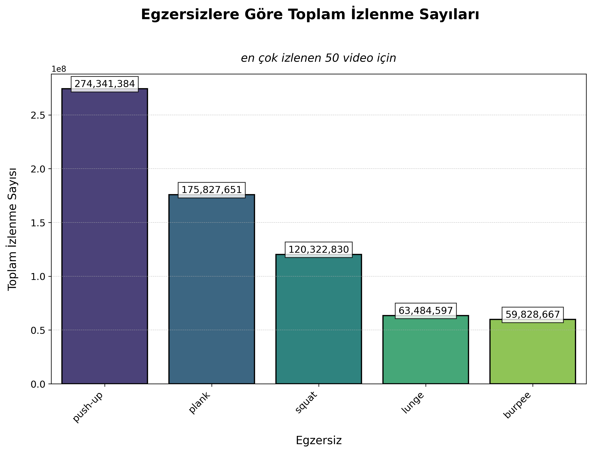
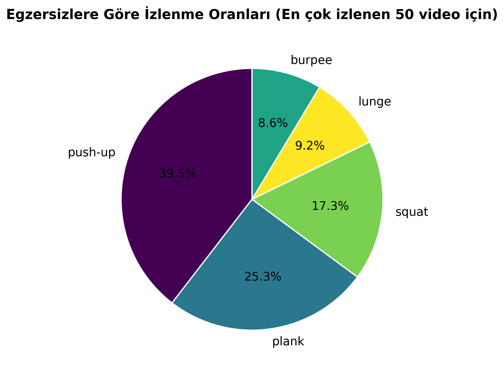

# Youtube-Fitness-Veri-Analizi

Proje Tanımı: Bu projede, YouTube Data API'sini kullanarak en popüler 5 temel fitness egzersizinin (push-up, plank, squat, lunge, burpee) izlenme sayılarını analiz ettim.

Amacı: Hangi egzersiz videolarının en çok ilgi gördüğünü belirlemek ve bu veriyi anlaşılır görsellerle sunmaktı.

Veri Kaynağı: YouTube Data API v3.

Yöntem: Her bir egzersiz için en çok izlenen 50 video toplandı. Bu verilerle bir Pandas DataFrame oluşturuldu ve analiz edildi.

Bulgular (Sonuçlar): Analizlerimize göre, push-up egzersizi en yüksek toplam izlenme sayısına ulaşmıştır. Bu da, YouTube'da bu konunun en çok ilgi çeken konuların başında geldiğini gösterir.

### Görselleştirme

Projemizde, elde ettiğimiz verileri daha iyi anlatmak için aşağıdaki görselleştirmeleri kullandık:

#### Egzersizlere Göre Toplam İzlenme Sayıları

)

#### Egzersizlere Göre Yüzdesel İzlenme Oranları

)
